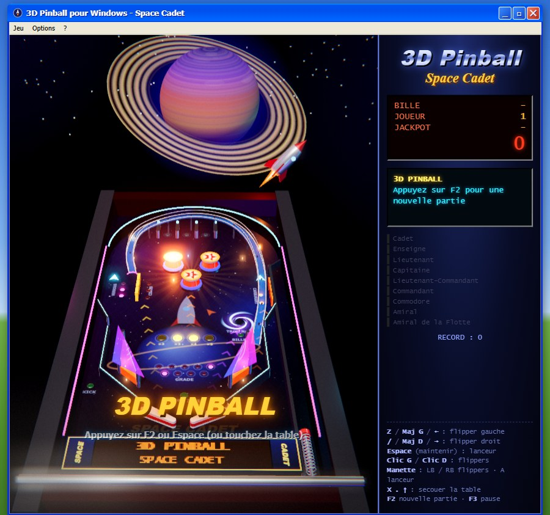

# 3D Pinball – Space Cadet

Recréation hommage du flipper livré avec Windows XP, jouable dans le navigateur, en 3D (Three.js) ou en 2D.

**▶ Jouer : https://jeanjacquesserpoul.github.io/pinball/**



## Fonctionnalités

- **Table complète** : flippers, bumpers, slingshots, cibles tombantes, cibles carburant, trou noir, couloirs du haut, orbites, **rampe métallique surélevée**, kickback, tir d'adresse.
- **Multibille** (3 billes) avec **jackpot** qui grossit en jouant.
- **12 missions** (dont des missions à étapes et chronométrées) et **9 grades**, de Cadet à Amiral de la Flotte.
- **Rendu 3D** : éclairage réaliste, reflets dynamiques sur la bille, halos, particules, afficheur à points sur le tablier, caméra animée, ralenti et rediffusion. Réglage de qualité automatique.
- **Rendu 2D** classique en option (touche F6).
- **Musique générative** et effets sonores spatialisés, synthétisés en direct.
- **Rejouabilité** : top 10 avec initiales, statistiques, **défi du jour**, trois niveaux de difficulté.
- **Jouable partout** : clavier, souris, écran tactile, manette Xbox (avec vibrations) ; mise en page adaptée aux téléphones.
- **Installable** comme une application et **jouable hors ligne**.
- **Accessibilité** : touches reconfigurables, réduction des mouvements, taille du texte.

## Commandes

| Action | Clavier | Souris | Manette |
|---|---|---|---|
| Flipper gauche | Z, Maj gauche, ← | clic gauche | LB / LT |
| Flipper droit | /, Maj droite, → | clic droit | RB / RT |
| Lanceur (maintenir) | Espace, Entrée, ↓ | clic molette | A |
| Secouer la table | X, ., ↑ | – | X, B, Y |
| Nouvelle partie / pause | F2 / F3 | – | Menu |
| 2D ↔ 3D / zoom | F6 / F7 | – | Affichage / clic stick droit |

Sur écran tactile : moitié gauche ou droite de la table pour les flippers, coin bas-droit pour le lanceur.

## Développement

Le jeu est publié sous la forme d'un **fichier unique `index.html`**, qui marche aussi en l'ouvrant directement depuis le disque. Il est assemblé à partir des sources :

```
src/
  template.html     structure de la page (fenêtre Windows XP, panneau, menus)
  style.css         styles
  js/01-config.js   géométrie de la table, missions, état
  js/02-audio.js    sons et musique (WebAudio)
  js/03-ui.js       panneau d'informations
  js/04-rules.js    règles : missions, multibille, bonus
  js/05-physics.js  physique de la bille
  js/06-art.js      décor de la table
  js/07-render2d.js rendu 2D
  js/08-loop.js     boucle de jeu, ralenti, rediffusion
  js/09-input.js    clavier, souris, tactile, manette
  js/10-window.js   fenêtre, menus, dialogues
  js/11-boot.js     démarrage, options
  js/12-meta.js     scores, statistiques, défi du jour
  js/13-access.js   accessibilité
  js/render3d.js    moteur 3D (Three.js)
vendor/three/       Three.js r160 (licence MIT)
test/               tests (physique et règles, sans navigateur)
```

```bash
npm run build   # assemble src/ en index.html
npm test        # lance les tests
npm run check   # vérifie que index.html est à jour
```

Aucune dépendance à installer : Node.js 22 ou plus suffit. Les tests sont lancés automatiquement sur GitHub à chaque envoi.

## Crédits

Hommage non officiel au *3D Pinball for Windows – Space Cadet* (Maxis / Microsoft). Aucun fichier d'origine n'est utilisé : graphismes, sons et physique sont entièrement recréés par code. Rendu 3D avec [Three.js](https://threejs.org) (licence MIT).
